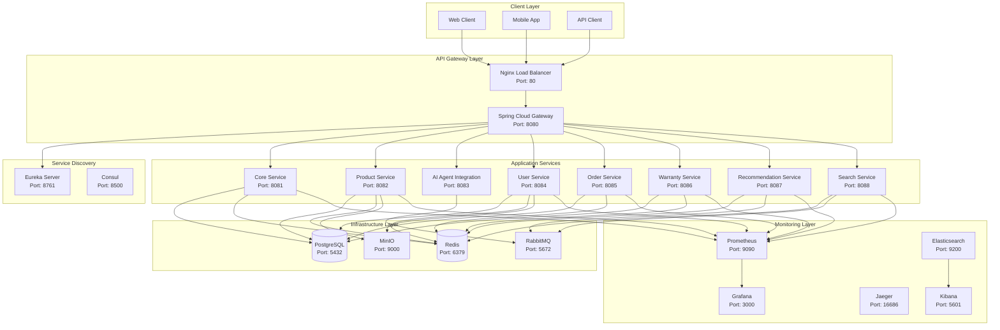

# AI Agent E-commerce Backend System

> **Hệ thống Backend Spring Boot hoàn chỉnh cho AI Agent E-commerce với Docker, tích hợp đầy đủ monitoring và observability**

[](https://spring.io/projects/spring-boot)
[](https://openjdk.java.net/)
[](https://www.docker.com/)
[](https://www.postgresql.org/)
[](https://redis.io/)
[](https://www.rabbitmq.com/)

## Mục lục

- [Kiến trúc Tổng quan](#-kiến-trúc-tổng-quan)
- [Docker Infrastructure](#-docker-infrastructure)
- [Cấu trúc Dự án](#-cấu-trúc-dự-án)
- [Cài đặt và Chạy](#-cài-đặt-và-chạy)
- [Service URLs](#-service-urls)
- [Test API](#-test-api)
- [Docker Management](#-docker-management)
- [Tính năng chính](#-tính-năng-chính)
- [Monitoring & Observability](#-monitoring--observability)
- [Troubleshooting](#-troubleshooting)
- [Production Deployment](#-production-deployment)
- [Quick Start Guide](#-quick-start-guide)

## Kiến trúc Tổng quan

### Microservices Architecture



### Tech Stack

| Category | Technology | Version | Purpose |
|----------|------------|---------|---------|
| **Backend** | Spring Boot | 3.2+    | Microservices framework |
| **Language** | Java | 21+     | Programming language |
| **Service Discovery** | Eureka Server | Latest  | Service registration |
| **API Gateway** | Spring Cloud Gateway | Latest  | Routing & load balancing |
| **Database** | PostgreSQL | 15+     | Primary database |
| **Cache** | Redis | 7+      | Caching & session storage |
| **Message Queue** | RabbitMQ | 3.12+   | Asynchronous messaging |
| **AI Integration** | Python FastAPI | Latest  | AI Agent service |
| **Vector Search** | Pinecone | Latest  | Semantic search |
| **Build Tool** | Maven | 3.8+    | Dependency management |
| **Containerization** | Docker | 20.10+  | Container platform |
| **Orchestration** | Docker Compose | 2.0+    | Multi-container management |

## Docker Infrastructure

### Core Infrastructure

| Service | Port | Description | Credentials |
|---------|------|-------------|-------------|
| **PostgreSQL 15** | 5432 | Primary database | postgres/password |
| **Redis 7** | 6379 | Cache & session storage | redis_password |
| **RabbitMQ 3.12** | 5672/15672 | Message queue | admin/rabbitmq_password |

### Monitoring & Observability

| Service | Port | Description | Credentials |
|---------|------|-------------|-------------|
| **Prometheus** | 9090 | Metrics collection | - |
| **Grafana** | 3000 | Monitoring dashboards | admin/grafana_password |
| **Jaeger** | 16686 | Distributed tracing | - |
| **Elasticsearch** | 9200 | Log storage & search | - |
| **Kibana** | 5601 | Log visualization | - |

### Additional Tools

| Service | Port | Description | Credentials |
|---------|------|-------------|-------------|
| **Nginx** | 80/443 | Load balancer & reverse proxy | - |
| **Consul** | 8500 | Service discovery | - |
| **MinIO** | 9000/9001 | Object storage | minioadmin/minio_password |
| **Adminer** | 8080 | Database management UI | - |

## Cấu trúc Dự án

```
ai-agent-backend/
├── 📁 ai-agent-discovery/         # Eureka Server (Port: 8761)
├── 📁 ai-agent-gateway/           # API Gateway (Port: 8080)
├── 📁 ai-agent-core/              # Core Service (Port: 8081)
├── 📁 product-service/            # Product Management (Port: 8082)
├── 📁 ai-agent-integration/       # AI Agent Integration (Port: 8083)
├── 📁 user-service/               # User Management (Port: 8084)
├── 📁 order-service/              # Order Management (Port: 8085)
├── 📁 warranty-service/           # Warranty Management (Port: 8086)
├── 📁 recommendation-service/     # AI Recommendations (Port: 8087)
├── 📁 search-service/             # Search Service (Port: 8088)
├── 📁 infrastructure/             # Docker infrastructure
│   └── 📁 docker/                 # Dockerfiles for all services
├── 📁 monitoring/                 # Monitoring configurations
│   ├── 📁 prometheus/             # Prometheus configuration
│   └── 📁 grafana/                # Grafana dashboards & datasources
├── 📁 nginx/                      # Nginx configuration
├── 📁 database/                   # Database initialization scripts
├── 📁 scripts/                    # Docker management scripts
│   ├── 🐚 docker-start.sh         # Start all services
│   ├── 🐚 docker-stop.sh          # Stop all services
│   ├── 🐚 docker-build.sh         # Build all images
│   └── 🐚 docker-logs.sh          # View service logs
├── 🐳 docker-compose.yml          # Docker Compose configuration
├── ⚙️ env.example                 # Environment variables template
└── 📄 pom.xml                     # Parent POM
```

## Cài đặt và Chạy

### Yêu cầu Hệ thống

| Requirement | Minimum | Recommended |
|-------------|---------|-------------|
| **Docker** | 20.10+ | Latest |
| **Docker Compose** | 2.0+ | Latest |
| **Memory** | 8GB RAM | 16GB RAM |
| **Storage** | 20GB | 50GB |
| **CPU** | 4 cores | 8 cores |

### Cách 1: Chạy với Docker (Khuyến nghị)

#### 1️⃣ Chuẩn bị môi trường Windows

**Yêu cầu:**
- Windows 10/11 (64-bit)
- Docker Desktop for Windows
- Git for Windows
- PowerShell hoặc Command Prompt

**Cài đặt Docker Desktop:**
1. Tải Docker Desktop từ: https://www.docker.com/products/docker-desktop/
2. Cài đặt và khởi động Docker Desktop
3. Đảm bảo Docker Desktop đang chạy (icon Docker trong system tray)

#### 2️⃣ Clone và Setup
```powershell
# Mở PowerShell as Administrator
# Clone repository
git clone <repository-url>
cd ai-agent-backend

# Cấp quyền cho PowerShell scripts
Set-ExecutionPolicy -ExecutionPolicy RemoteSigned -Scope CurrentUser

# Hoặc sử dụng Command Prompt
cmd
cd ai-agent-backend
```

#### 3️⃣ Cấu hình Environment
```powershell
# Copy environment template
copy env.example .env

# Mở file .env để chỉnh sửa
notepad .env
# hoặc
code .env  # nếu có VS Code
```

**Các API keys cần cập nhật trong `.env`:**
```env
# AI/ML API Keys
OPENAI_API_KEY=your_openai_api_key
GEMINI_API_KEY=your_gemini_api_key
GROQ_API_KEY=your_groq_api_key
PINECONE_API_KEY=your_pinecone_api_key
ANTHROPIC_API_KEY=your_anthropic_api_key
```

#### 4️⃣ Chạy Hệ thống

**Option A: Sử dụng Docker Compose trực tiếp**
```powershell
# Chạy infrastructure services trước
docker-compose up -d postgresql redis rabbitmq prometheus grafana

# Đợi 30 giây để services khởi động
Start-Sleep -Seconds 30

# Chạy application services
docker-compose up -d ai-agent-discovery ai-agent-gateway
docker-compose up -d product-service user-service order-service
docker-compose up -d warranty-service recommendation-service search-service
docker-compose up -d ai-agent-integration
```


#### 5️⃣ Chạy với Python AI Agent
```powershell
# Chạy với Python AI Agent
docker-compose --profile ai-agent up -d
```

### 💻 Cách 2: Chạy trên IntelliJ IDEA (Windows)

#### 1️⃣ Chuẩn bị Infrastructure
```powershell
# Mở PowerShell trong thư mục project
cd ai-agent-backend

# Chạy chỉ infrastructure services
docker-compose up -d postgresql redis rabbitmq prometheus grafana

# Kiểm tra services đang chạy
docker-compose ps
```

#### 2️⃣ Cài đặt IntelliJ IDEA trên Windows

**Yêu cầu:**
- IntelliJ IDEA Community/Ultimate
- JDK 17+ (có thể cài qua IntelliJ)
- Maven 3.8+ (có thể cài qua IntelliJ)

**Cài đặt:**
1. Tải IntelliJ IDEA từ: https://www.jetbrains.com/idea/
2. Cài đặt và khởi động IntelliJ IDEA
3. Cài đặt JDK 17+ qua File → Project Structure → SDKs
4. Cài đặt Maven qua File → Settings → Build Tools → Maven

#### 3️⃣ Import Project vào IntelliJ IDEA

**Cách 1: Mở từ IntelliJ IDEA**
1. Mở IntelliJ IDEA
2. Chọn "Open" → chọn thư mục `ai-agent-backend`
3. IntelliJ sẽ tự động detect Maven project
4. Chọn "Import Maven project" nếu được hỏi

**Cách 2: Mở từ Command Line**
```powershell
# Mở IntelliJ IDEA từ command line
"C:\Program Files\JetBrains\IntelliJ IDEA 2023.3\bin\idea64.exe" ai-agent-backend
```

#### 4️⃣ Cấu hình Project

**Cấu hình JDK:**
1. File → Project Structure → Project
2. Chọn Project SDK: Java 17
3. Chọn Project language level: 17

**Cấu hình Maven:**
1. File → Settings → Build Tools → Maven
2. Maven home directory: Use bundled Maven
3. User settings file: để trống
4. Local repository: để trống

#### 5️⃣ Chạy Spring Boot Services

**Tạo Run Configurations:**

1. **Eureka Server (DiscoveryApplication)**
   - Right-click `DiscoveryApplication.java` → Run
   - Port: 8761
   - Profile: default

2. **Core Service (CoreApplication)**
   - Right-click `CoreApplication.java` → Run
   - Port: 8081
   - Profile: default

3. **Product Service (ProductServiceApplication)**
   - Right-click `ProductServiceApplication.java` → Run
   - Port: 8082
   - Profile: default

4. **AI Agent Integration (AiAgentIntegrationApplication)**
   - Right-click `AiAgentIntegrationApplication.java` → Run
   - Port: 8083
   - Profile: default

5. **User Service (UserServiceApplication)**
   - Right-click `UserServiceApplication.java` → Run
   - Port: 8084
   - Profile: default

6. **Order Service (OrderServiceApplication)**
   - Right-click `OrderServiceApplication.java` → Run
   - Port: 8085
   - Profile: default

7. **Warranty Service (WarrantyServiceApplication)**
   - Right-click `WarrantyServiceApplication.java` → Run
   - Port: 8086
   - Profile: default

8. **Recommendation Service (RecommendationServiceApplication)**
   - Right-click `RecommendationServiceApplication.java` → Run
   - Port: 8087
   - Profile: default

9. **Search Service (SearchServiceApplication)**
   - Right-click `SearchServiceApplication.java` → Run
   - Port: 8088
   - Profile: default

10. **API Gateway (GatewayApplication)**
    - Right-click `GatewayApplication.java` → Run
    - Port: 8080
    - Profile: default

**Thứ tự chạy services:**
1. Eureka Server (8761) - Chạy đầu tiên
2. Core Service (8081) - Chạy thứ 2
3. Product Service (8082) - Chạy thứ 3
4. AI Agent Integration (8083) - Chạy thứ 4
5. User Service (8084) - Chạy thứ 5
6. Order Service (8085) - Chạy thứ 6
7. Warranty Service (8086) - Chạy thứ 7
8. Recommendation Service (8087) - Chạy thứ 8
9. Search Service (8088) - Chạy thứ 9
10. API Gateway (8080) - Chạy cuối cùng

#### 6️⃣ Troubleshooting IntelliJ IDEA

**Nếu gặp lỗi "Cannot resolve symbol":**
1. File → Invalidate Caches and Restart
2. Maven → Reload project
3. File → Project Structure → Modules → Dependencies → Add Library

**Nếu gặp lỗi "Port already in use":**
1. Kiểm tra port đang được sử dụng: `netstat -ano | findstr :8080`
2. Kill process: `taskkill /PID <pid> /F`
3. Restart service

**Nếu gặp lỗi "Database connection failed":**
1. Đảm bảo PostgreSQL đang chạy: `docker-compose ps`
2. Kiểm tra connection string trong `application.yml`
3. Restart Docker Desktop nếu cần

## 📡 Service URLs

### 🌐 Application Services

| Service | URL | Description |
|---------|-----|-------------|
| **API Gateway** | http://localhost:8080 | Main entry point |
| **Eureka Dashboard** | http://localhost:8761 | Service registry |
| **Core Service** | http://localhost:8081 | Core AI functionality |
| **Product Service** | http://localhost:8082 | Product management |
| **AI Agent Integration** | http://localhost:8083 | AI Agent communication |
| **User Service** | http://localhost:8084 | User management |
| **Order Service** | http://localhost:8085 | Order processing |
| **Warranty Service** | http://localhost:8086 | Warranty management |
| **Recommendation Service** | http://localhost:8087 | AI recommendations |
| **Search Service** | http://localhost:8088 | Search functionality |

### 🛠️ Infrastructure & Monitoring

| Service | URL | Description | Credentials |
|---------|-----|-------------|-------------|
| **Adminer (DB UI)** | http://localhost:8080 | Database management | postgres/ |
| **Grafana** | http://localhost:3000 | Monitoring dashboards | admin/grafana_password |
| **Prometheus** | http://localhost:9090 | Metrics collection | - |
| **Jaeger** | http://localhost:16686 | Distributed tracing | - |
| **Kibana** | http://localhost:5601 | Log visualization | - |
| **Consul** | http://localhost:8500 | Service discovery | - |
| **MinIO** | http://localhost:9001 | Object storage | minioadmin/minio_password |
| **RabbitMQ Management** | http://localhost:15672 | Message queue UI | admin/rabbitmq_password |

## 🧪 Test API

### 🔍 Test through API Gateway

```bash
# Health check
curl http://localhost:8080/api/core/health

# Get all products
curl http://localhost:8080/api/products

# Search products
curl "http://localhost:8080/api/products/search?keyword=iPhone"

# Get users
curl http://localhost:8080/api/users

# Get orders
curl http://localhost:8080/api/orders

# AI Agent chat
curl -X POST http://localhost:8080/api/ai-agent/ask \
  -H "Content-Type: application/json" \
  -d '{
    "message": "OnePlus under 50 million",
    "user_id": "user123",
    "session_id": "session001"
  }'
```

### 🔧 Test Individual Services

```bash
# Product Service
curl http://localhost:8082/api/products

# User Service
curl http://localhost:8084/api/users

# Order Service
curl http://localhost:8085/api/orders

# Search Service
curl "http://localhost:8088/api/search/semantic?query=iPhone 15"
```

## 🔧 Docker Management

### 📜 Management Commands

### 🐳 Docker Commands (Windows)

**PowerShell Commands:**
```powershell
# Start specific services
docker-compose up -d postgresql redis rabbitmq

# View logs
docker-compose logs -f ai-agent-gateway

# Restart service
docker-compose restart ai-agent-gateway

# Scale service
docker-compose up -d --scale product-service=3

# Stop all services
docker-compose down

# Stop and remove volumes
docker-compose down -v

# Check service status
docker-compose ps

# Check resource usage
docker stats

# Clean up unused resources
docker system prune -a

# View running containers
docker ps

# View all containers (including stopped)
docker ps -a

# View images
docker images

# Remove specific container
docker rm <container-name>

# Remove specific image
docker rmi <image-name>
```

**Command Prompt Commands:**
```cmd
# Start specific services
docker-compose up -d postgresql redis rabbitmq

# View logs
docker-compose logs -f ai-agent-gateway

# Restart service
docker-compose restart ai-agent-gateway

# Scale service
docker-compose up -d --scale product-service=3

# Stop all services
docker-compose down

# Stop and remove volumes
docker-compose down -v

# Check service status
docker-compose ps

# Check resource usage
docker stats
```

### 🛠️ Windows-specific Tips

**1. Docker Desktop Settings:**
- Mở Docker Desktop → Settings
- Resources → Memory: 8GB+ (khuyến nghị)
- Resources → CPUs: 4+ cores
- Resources → Disk: 50GB+

**2. Windows Firewall:**
- Cho phép Docker Desktop qua Windows Firewall
- Cho phép các ports: 8080, 8761, 3000, 9090, 5432, 6379

**3. Antivirus Software:**
- Thêm thư mục project vào exclusion list
- Thêm Docker Desktop vào exclusion list

**4. PowerShell Execution Policy:**
```powershell
# Set execution policy for current user
Set-ExecutionPolicy -ExecutionPolicy RemoteSigned -Scope CurrentUser

# Check current execution policy
Get-ExecutionPolicy
```

**5. Environment Variables:**
```powershell
# Set environment variables for current session
$env:DOCKER_BUILDKIT=1
$env:COMPOSE_DOCKER_CLI_BUILD=1

# Set environment variables permanently
[Environment]::SetEnvironmentVariable("DOCKER_BUILDKIT", "1", "User")
[Environment]::SetEnvironmentVariable("COMPOSE_DOCKER_CLI_BUILD", "1", "User")
```

## 🎯 Tính năng chính

### 📱 1. Product Management
- **27,000+ sản phẩm điện thoại** từ OnePlus, Samsung, Apple, Xiaomi, Motorola, Realme, Nothing
- **Chi tiết sản phẩm**: CPU, RAM, ROM, camera, battery, screen, 5G, NFC, fast charging
- **Tìm kiếm thông minh**: Theo keyword, brand, category, price range
- **Rating và reviews**: Từ người dùng thực
- **Stock management**: Quản lý tồn kho

### 🤖 2. AI Agent Integration
- **Hybrid Orchestrator**: Rule-based + ML-based routing
- **RAG System**: Semantic search với Pinecone vector database
- **Multi-model Support**: Gemini, Groq, Ollama, OpenAI, Claude
- **Personalization**: User profiles và recommendations
- **Real-time Chat**: Tương tác tự nhiên với AI

### 👥 3. User Management
- **User Profiles**: Thông tin cá nhân, địa chỉ, preferences
- **Authentication**: User verification và role management
- **Personalization**: User preferences và purchase history
- **Wishlist**: Danh sách yêu thích

### 🛒 4. Order Management
- **Order Processing**: Tạo, cập nhật, hủy đơn hàng
- **Order Tracking**: Theo dõi trạng thái đơn hàng
- **Payment Integration**: Quản lý thanh toán
- **Order History**: Lịch sử đơn hàng của user

### 🛡️ 5. Warranty Management
- **Warranty Registration**: Đăng ký bảo hành
- **Warranty Tracking**: Theo dõi bảo hành
- **Claim Management**: Xử lý yêu cầu bảo hành
- **Warranty Extension**: Gia hạn bảo hành

### 🎯 6. Recommendation Engine
- **Personalized Recommendations**: Dựa trên user behavior
- **Product Recommendations**: Sản phẩm tương tự
- **Trending Products**: Sản phẩm hot
- **New Arrivals**: Sản phẩm mới
- **On-sale Products**: Sản phẩm giảm giá

### 🔍 7. Search Service
- **Semantic Search**: Tìm kiếm ngữ nghĩa với AI
- **Keyword Search**: Tìm kiếm từ khóa
- **Fuzzy Search**: Tìm kiếm gần đúng
- **Autocomplete**: Gợi ý tìm kiếm
- **Advanced Search**: Tìm kiếm nâng cao với filters

### 📊 8. Monitoring & Observability
- **Prometheus**: Metrics collection cho tất cả services
- **Grafana**: Dashboards cho monitoring
- **Jaeger**: Distributed tracing
- **Elasticsearch + Kibana**: Log aggregation và analysis
- **Health Checks**: Tự động health monitoring

## 📊 Monitoring & Observability

### 📈 Grafana Dashboards

| Dashboard | Description | Metrics |
|-----------|-------------|---------|
| **System Overview** | CPU, Memory, Disk usage | System resources |
| **Application Metrics** | Request rates, response times, error rates | HTTP requests |
| **Database Metrics** | Connection pools, query performance | PostgreSQL metrics |
| **Cache Metrics** | Redis hit/miss ratios | Redis performance |
| **Message Queue Metrics** | RabbitMQ queue depths, message rates | Queue performance |

### 📊 Prometheus Metrics

| Category | Metrics | Description |
|----------|---------|-------------|
| **JVM Metrics** | Memory, GC, threads | Java Virtual Machine |
| **Spring Boot Metrics** | HTTP requests, database connections | Application metrics |
| **Custom Metrics** | Business logic metrics | Custom business metrics |
| **Infrastructure Metrics** | PostgreSQL, Redis, RabbitMQ | Infrastructure health |

### 🔍 Jaeger Tracing

| Feature | Description |
|---------|-------------|
| **Request Tracing** | End-to-end request tracing |
| **Service Dependencies** | Service interaction mapping |
| **Performance Analysis** | Latency analysis |
| **Error Tracking** | Error propagation tracking |

## 🐛 Troubleshooting

### 🐳 Docker Issues (Windows)

**PowerShell Commands:**
```powershell
# Check service status
docker-compose ps

# Check logs
docker-compose logs ai-agent-gateway

# Restart service
docker-compose restart ai-agent-gateway

# Check resource usage
docker stats

# Clean up
docker-compose down -v
docker system prune -a

# Check Docker Desktop status
docker version
docker info
```

**Command Prompt Commands:**
```cmd
# Check service status
docker-compose ps

# Check logs
docker-compose logs ai-agent-gateway

# Restart service
docker-compose restart ai-agent-gateway

# Check resource usage
docker stats

# Clean up
docker-compose down -v
docker system prune -a
```

**Common Docker Issues on Windows:**

1. **Docker Desktop not starting:**
   - Restart Docker Desktop
   - Check Windows features: Hyper-V, WSL2
   - Run as Administrator

2. **Port already in use:**
   ```powershell
   # Find process using port
   netstat -ano | findstr :8080
   
   # Kill process
   taskkill /PID <pid> /F
   ```

3. **Permission denied:**
   - Run PowerShell as Administrator
   - Check Docker Desktop settings
   - Restart Docker Desktop

4. **Out of memory:**
   - Increase Docker Desktop memory limit
   - Close other applications
   - Restart Docker Desktop

### 🗄️ Database Issues (Windows)

**PowerShell Commands:**
```powershell
# Connect to PostgreSQL
docker-compose exec postgresql psql -U postgres -d ai_agent_db

# Check Redis
docker-compose exec redis redis-cli ping

# Check RabbitMQ
docker-compose exec rabbitmq rabbitmq-diagnostics status

# Check database connection
docker-compose exec postgresql pg_isready -U postgres
```

**Command Prompt Commands:**
```cmd
# Connect to PostgreSQL
docker-compose exec postgresql psql -U postgres -d ai_agent_db

# Check Redis
docker-compose exec redis redis-cli ping

# Check RabbitMQ
docker-compose exec rabbitmq rabbitmq-diagnostics status
```

**Common Database Issues on Windows:**

1. **PostgreSQL connection failed:**
   - Check if PostgreSQL container is running
   - Verify port 5432 is not blocked
   - Check Windows Firewall settings

2. **Redis connection failed:**
   - Check if Redis container is running
   - Verify port 6379 is not blocked
   - Check Redis password in .env file

3. **RabbitMQ connection failed:**
   - Check if RabbitMQ container is running
   - Verify ports 5672 and 15672 are not blocked
   - Check RabbitMQ credentials in .env file

### 🔍 Service Discovery Issues (Windows)

**PowerShell Commands:**
```powershell
# Check Eureka
Invoke-WebRequest -Uri "http://localhost:8761/eureka/apps" -UseBasicParsing

# Check Consul
Invoke-WebRequest -Uri "http://localhost:8500/v1/agent/services" -UseBasicParsing

# Check service health
Invoke-WebRequest -Uri "http://localhost:8080/actuator/health" -UseBasicParsing

# Test API Gateway
Invoke-WebRequest -Uri "http://localhost:8080/api/core/health" -UseBasicParsing
```

**Command Prompt Commands:**
```cmd
# Check Eureka
curl http://localhost:8761/eureka/apps

# Check Consul
curl http://localhost:8500/v1/agent/services

# Check service health
curl http://localhost:8080/actuator/health

# Test API Gateway
curl http://localhost:8080/api/core/health
```

**Common Service Discovery Issues on Windows:**

1. **Eureka not accessible:**
   - Check if Eureka container is running
   - Verify port 8761 is not blocked
   - Check Windows Firewall settings

2. **Services not registering:**
   - Check Eureka client configuration
   - Verify network connectivity
   - Check service startup order

3. **API Gateway not routing:**
   - Check Gateway configuration
   - Verify service discovery
   - Check routing rules

### 🛠️ Windows-specific Issues

**1. PowerShell Execution Policy:**
```powershell
# Check current policy
Get-ExecutionPolicy

# Set policy for current user
Set-ExecutionPolicy -ExecutionPolicy RemoteSigned -Scope CurrentUser

# Set policy for all users (requires admin)
Set-ExecutionPolicy -ExecutionPolicy RemoteSigned -Scope LocalMachine
```

**2. Windows Firewall:**
```powershell
# Check firewall status
Get-NetFirewallProfile

# Allow specific ports
New-NetFirewallRule -DisplayName "Docker Ports" -Direction Inbound -Protocol TCP -LocalPort 8080,8761,3000,9090,5432,6379 -Action Allow
```

**3. Antivirus Software:**
- Add project folder to exclusion list
- Add Docker Desktop to exclusion list
- Temporarily disable real-time protection during development

**4. WSL2 Issues:**
```powershell
# Check WSL2 status
wsl --status

# Update WSL2
wsl --update

# Restart WSL2
wsl --shutdown
```

**5. Hyper-V Issues:**
```powershell
# Check Hyper-V status
Get-WindowsOptionalFeature -Online -FeatureName Microsoft-Hyper-V-All

# Enable Hyper-V (requires restart)
Enable-WindowsOptionalFeature -Online -FeatureName Microsoft-Hyper-V-All
```

## 🚀 Production Deployment

### ⚙️ Environment Variables

```bash
# Copy and update environment file
cp env.example .env

# Update with production values
nano .env
```

**Production Environment Variables:**
```bash
# Database
POSTGRES_PASSWORD=strong_production_password
REDIS_PASSWORD=strong_redis_password

# Security
JWT_SECRET=very_long_random_secret_key
JWT_EXPIRATION=86400000

# API Keys
OPENAI_API_KEY=your_production_openai_key
GEMINI_API_KEY=your_production_gemini_key
PINECONE_API_KEY=your_production_pinecone_key
```

### 📈 Scaling

```bash
# Scale specific services
docker-compose up -d --scale product-service=3 --scale user-service=2

# Use Docker Swarm for production
docker stack deploy -c docker-compose.yml ai-agent-stack
```

### 🔒 Security

- ✅ Update default passwords in `.env`
- ✅ Enable SSL/TLS in Nginx
- ✅ Configure firewall rules
- ✅ Use secrets management
- ✅ Enable authentication
- ✅ Regular security updates

## 📋 Quick Start Guide (Windows)

### 🚀 1. Docker Setup

**PowerShell Commands:**
```powershell
# Clone repository
git clone <repository-url>
cd ai-agent-backend

# Setup environment
copy env.example .env
# Update .env with your API keys

# Start system
docker-compose up -d postgresql redis rabbitmq prometheus grafana
Start-Sleep -Seconds 30
docker-compose up -d ai-agent-discovery ai-agent-gateway
docker-compose up -d product-service user-service order-service
docker-compose up -d warranty-service recommendation-service search-service
docker-compose up -d ai-agent-integration
```

**Command Prompt Commands:**
```cmd
# Clone repository
git clone <repository-url>
cd ai-agent-backend

# Setup environment
copy env.example .env
# Update .env with your API keys

# Start system
docker-compose up -d postgresql redis rabbitmq prometheus grafana
timeout /t 30 /nobreak
docker-compose up -d ai-agent-discovery ai-agent-gateway
docker-compose up -d product-service user-service order-service
docker-compose up -d warranty-service recommendation-service search-service
docker-compose up -d ai-agent-integration
```


### ✅ 2. Verify System

**PowerShell Commands:**
```powershell
# Check all services
docker-compose ps

# Test API Gateway
Invoke-WebRequest -Uri "http://localhost:8080/api/core/health" -UseBasicParsing

# Check Eureka
Invoke-WebRequest -Uri "http://localhost:8761/eureka/apps" -UseBasicParsing

# Check service health
Invoke-WebRequest -Uri "http://localhost:8080/actuator/health" -UseBasicParsing
```

**Command Prompt Commands:**
```cmd
# Check all services
docker-compose ps

# Test API Gateway
curl http://localhost:8080/api/core/health

# Check Eureka
curl http://localhost:8761/eureka/apps

# Check service health
curl http://localhost:8080/actuator/health
```

**Browser Testing:**
1. Mở trình duyệt
2. Truy cập: http://localhost:8080/api/core/health
3. Truy cập: http://localhost:8761 (Eureka Dashboard)
4. Truy cập: http://localhost:3000 (Grafana)

### 📊 3. Access Dashboards

| Dashboard | URL | Purpose | Credentials |
|-----------|-----|---------|-------------|
| **API Gateway** | http://localhost:8080 | Main application | - |
| **Eureka Dashboard** | http://localhost:8761 | Service registry | - |
| **Grafana** | http://localhost:3000 | Monitoring | admin/grafana_password |
| **Prometheus** | http://localhost:9090 | Metrics | - |
| **Jaeger** | http://localhost:16686 | Tracing | - |
| **Kibana** | http://localhost:5601 | Log visualization | - |
| **MinIO** | http://localhost:9001 | Object storage | minioadmin/minio_password |
| **RabbitMQ Management** | http://localhost:15672 | Message queue | admin/rabbitmq_password |

### 🛠️ 4. Windows-specific Setup

**1. Enable WSL2 (if not already enabled):**
```powershell
# Run as Administrator
dism.exe /online /enable-feature /featurename:Microsoft-Windows-Subsystem-Linux /all /norestart
dism.exe /online /enable-feature /featurename:VirtualMachinePlatform /all /norestart
wsl --set-default-version 2
```

**2. Install Docker Desktop:**
1. Download from: https://www.docker.com/products/docker-desktop/
2. Install and restart
3. Enable WSL2 integration in settings

**3. Configure Windows Firewall:**
```powershell
# Run as Administrator
New-NetFirewallRule -DisplayName "Docker Ports" -Direction Inbound -Protocol TCP -LocalPort 8080,8761,3000,9090,5432,6379,5672,15672,16686,5601,9000,9001 -Action Allow
```

**4. Set PowerShell Execution Policy:**
```powershell
# Run as Administrator
Set-ExecutionPolicy -ExecutionPolicy RemoteSigned -Scope CurrentUser
```

### 🚨 5. Common Issues & Solutions

**Issue: Docker Desktop not starting**
- Solution: Restart Docker Desktop, check Hyper-V/WSL2

**Issue: Port already in use**
- Solution: `netstat -ano | findstr :8080` then `taskkill /PID <pid> /F`

**Issue: Permission denied**
- Solution: Run PowerShell as Administrator

**Issue: Services not starting**
- Solution: Check Docker Desktop resources, increase memory limit

**Issue: Database connection failed**
- Solution: Verify PostgreSQL container is running, check firewall

### 📱 6. Mobile/Tablet Access

**Access from other devices on same network:**
1. Find your Windows IP: `ipconfig`
2. Replace localhost with your IP:
   - http://192.168.1.100:8080 (API Gateway)
   - http://192.168.1.100:8761 (Eureka)
   - http://192.168.1.100:3000 (Grafana)

**Example:**
```powershell
# Find your IP address
ipconfig | findstr "IPv4"

# Access from mobile device
# http://192.168.1.100:8080/api/core/health
```

---

## 🎉 Kết luận

**Hệ thống Backend Spring Boot hoàn chỉnh với Docker!** 🐳

**Tích hợp đầy đủ monitoring và observability!** 📊

**10 Microservices + Infrastructure + Monitoring!** 🚀

**Sẵn sàng cho production!** 🎯

### 📞 Support

Nếu bạn gặp vấn đề, hãy:
1. Kiểm tra logs: `./scripts/docker-logs.sh <service-name>`
2. Xem troubleshooting section
3. Tạo issue trên GitHub

### 🤝 Contributing

1. Fork repository
2. Tạo feature branch
3. Commit changes
4. Push to branch
5. Tạo Pull Request

---

**Made with ❤️ by AI Agent Team**