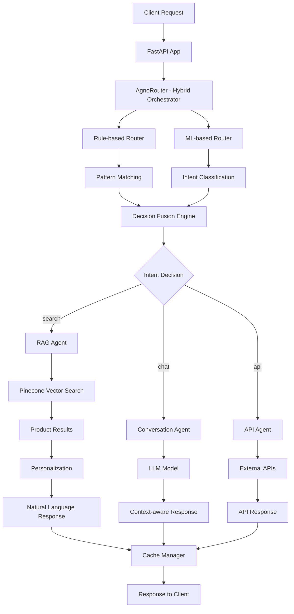

# AI Agent System - Hybrid Orchestrator

Intelligent AI Agent system for e-commerce with **Hybrid Orchestrator** combining rule-based and ML-based routing, using real dataset with 27,000+ phone products.

[](https://python.org)
[](https://fastapi.tiangolo.com)
[](https://pytorch.org)
[](https://pinecone.io)
[](LICENSE)

## Key Features

- **Hybrid Orchestrator**: Combines rule-based + ML-based routing (85-95% accuracy)
- **Real Dataset**: 27,000+ phone products from OnePlus, Samsung, Apple, Xiaomi, Motorola, Realme, Nothing
- **RAG System**: Semantic search with Pinecone vector database (v5.0.1+)
- **Smart Conversation**: Natural interaction with context-aware routing
- **API Integration**: Connect with microservices (orders, payments, warranty)
- **Personalization**: Learn from user behavior and provide relevant recommendations
- **Multi-model**: Support multiple LLMs (Gemini 0.8.3+, Groq 0.9.0+, Ollama 0.4.2+, OpenAI 1.58.1+, Claude 0.40.0+)
- **Caching**: Smart caching system with Redis 5.2.1+ and Memory cache
- **Monitoring**: Real-time performance monitoring with detailed dashboard
- **Training**: Fine-tune models for e-commerce domain with complete data pipeline
- **Production Ready**: FastAPI 0.115.6+, PyTorch 2.5.1+, modern async/await patterns

## System Architecture

### Hybrid Orchestrator Architecture


## Directory Structure

```
ai_agent/
├── app.py                        # FastAPI entry point
├── config.py                     # Configuration management
├── requirements.txt              # Python dependencies
├── env.example                   # Environment variables template
├── init_data.py                  # Data initialization
│
├── core/                         # Core logic (Hybrid Orchestrator)
│   ├── models/                   # Agent models
│   │   ├── base_agent.py         # Base agent class
│   │   ├── rag_agent.py          # RAG-specific agent
│   │   ├── conversation_agent.py # Conversation agent
│   │   ├── api_agent.py          # API integration agent
│   │   └── orchestrator.py       # Agent orchestrator
│   ├── router.py                 # Hybrid Orchestrator
│   ├── rag_model.py              # RAG model implementation
│   ├── interaction_model.py      # Conversation model
│   ├── api_model.py              # API model
│   ├── personalization_model.py  # Personalization model
│   └── prompts.py                # Prompt templates
│
├── adapters/                     # Adapter layer
│   ├── model_loader/             # Model loaders
│   │   ├── base_loader.py        # Base loader
│   │   ├── gemini_loader.py      # Google Gemini
│   │   ├── groq_loader.py        # Groq API
│   │   ├── ollama_loader.py      # Ollama local
│   │   └── openai_loader.py      # OpenAI GPT
│   └── pinecone_client.py        # Pinecone vector DB
│
├── cache/                        # Caching layer
│   ├── redis_cache.py            # Redis cache
│   ├── memory_cache.py           # In-memory cache
│   └── cache_manager.py          # Cache manager
│
├── monitoring/                   # Monitoring & observability
│   ├── metrics.py                # Metrics collection
│   ├── health_check.py           # Health monitoring
│   └── tracing.py                # Request tracing
│
├── personalization/              # Personalization layer
│   ├── profile_manager.py        # User profile management
│   ├── recommender.py            # Product recommendations
│   └── rl_feedback.py            # Reinforcement learning
│
├── services/                     # Microservices integration
│   ├── product_service.py        # Product API
│   ├── order_service.py          # Order API
│   ├── payment_service.py        # Payment API
│   ├── warranty_service.py       # Warranty API
│   └── mock/                     # Mock services
│       ├── mock_order.json
│       ├── mock_warranty.json
│       └── mock_payment.json
│
├── data/                         # Data management
│   ├── ingest.py                 # Data ingestion
│   ├── process_dataset.py        # Dataset processing
│   ├── processed/                # Processed data
│   ├── profiles/                 # User profiles
│   └── schema/                   # Data schemas
│
├── training/                     # Model training & fine-tuning
│   ├── dataset/                  # Real dataset
│   │   └── dataset.json          # 27,000+ real phone products
│   ├── prepare_data.py           # Data preparation
│   ├── finetune.py               # Model fine-tuning
│   ├── evaluate.py               # Model evaluation
│   └── training_pipeline.py      # Training pipeline
│
└── utils/                        # Utilities
    ├── logger.py                 # Logging utilities
    └── helpers.py                # Helper functions
```

## Installation

### 1. Clone repository
```bash
git clone <repository-url>
cd ai_agent
```

### 2. Create virtual environment
```bash
python -m venv venv
source venv/bin/activate  # Linux/Mac
# or
venv\Scripts\activate     # Windows
```

### 3. Install dependencies

#### Option 1: Full installation (recommended)
```bash
pip install -r requirements.txt
```

#### Option 2: Minimal installation (core features only)
```bash
pip install fastapi==0.115.6 uvicorn[standard]==0.32.1 pydantic==2.10.4 pydantic-settings==2.7.0 google-generativeai==0.8.3 pinecone-client==5.0.1 redis[hiredis]==5.2.1 httpx==0.28.1 python-dotenv==1.0.1 psutil==6.1.0
```

#### Option 3: Development installation
```bash
pip install -r requirements.txt black==24.10.0 isort==5.13.2 flake8==7.1.1 mypy==1.13.0 pytest==8.3.4 pytest-asyncio==0.24.0 pytest-cov==6.0.0
```

#### Option 4: Production installation
```bash
pip install fastapi==0.115.6 uvicorn[standard]==0.32.1 gunicorn==23.0.0 redis[hiredis]==5.2.1 pinecone-client==5.0.1 google-generativeai==0.8.3
```

### 4. Configure environment
```bash
cp env.example .env
# Edit .env with your API keys
# IMPORTANT: PINECONE_API_KEY is required to use vector database
```

### 5. Initialize data with real dataset
```bash
# Load 27,000+ real phone products into Pinecone
python init_data.py
```

### 6. Run application
```bash
python app.py
```

## Training & Fine-tuning (Optional)

### Prepare training data
```bash
python training/prepare_data.py
```

### Fine-tune model
```bash
python training/finetune.py
```

### Evaluate model
```bash
python training/evaluate.py
```

**Note**: Training is only necessary when you want to improve the model. The system works normally without training.

## Requirements

### Requirements files

1. **`requirements.txt`** - Full installation (recommended)
   - All AI APIs (Gemini 0.8.3+, Groq 0.9.0+, Ollama 0.4.2+, OpenAI 1.58.1+, Claude 0.40.0+)
   - Vector database (Pinecone 5.0.1+ cloud only)
   - Caching (Redis 5.2.1+, Memory cache)
   - Monitoring & observability (Prometheus, OpenTelemetry)
   - Personalization & ML (PyTorch 2.5.1+, Transformers 4.47.1+)
   - Development tools (Black 24.10.0+, pytest 8.3.4+)
   - Production server (Gunicorn 23.0.0+)

### Installation size comparison

| Installation Type | Size | Installation Time | Features |
|-------------------|------|-------------------|----------|
| Minimal | ~800MB | 3-5 minutes | Core APIs only |
| Full | ~3GB | 8-15 minutes | All features |
| Development | ~3.5GB | 10-20 minutes | Full + Dev tools |
| Production | ~1.2GB | 5-8 minutes | Production optimized |

### Version Compatibility

- **Python**: 3.10+ (recommended: 3.11+)
- **FastAPI**: 0.115.6+ (latest stable)
- **Pydantic**: 2.10.4+ (v2 only)
- **PyTorch**: 2.5.1+ (CUDA 12.1+ supported)
- **Transformers**: 4.47.1+ (latest)
- **Pinecone**: 5.0.1+ (latest API)

## Configuration

### API Keys (Free)
- **Gemini API**: Get from [Google AI Studio](https://makersuite.google.com/app/apikey) (v0.8.3+)
- **Groq API**: Get from [Groq Console](https://console.groq.com/) (v0.9.0+)
- **Ollama**: Install locally from [Ollama.ai](https://ollama.ai/) (v0.4.2+)

### Environment Variables
```bash
# Free APIs (Recommended)
GEMINI_API_KEY=your_gemini_api_key
GROQ_API_KEY=your_groq_api_key
OLLAMA_BASE_URL=http://localhost:11434

# Optional Paid APIs
OPENAI_API_KEY=your_openai_api_key  # v1.58.1+
ANTHROPIC_API_KEY=your_anthropic_api_key  # v0.40.0+
COHERE_API_KEY=your_cohere_api_key  # v5.5.3+

# Vector Database (Required for RAG)
PINECONE_API_KEY=your_pinecone_api_key  # v5.0.1+

# Configuration
MODEL_LOADER_BACKEND=gemini  # gemini, groq, ollama, openai, claude, cohere
ENABLE_PERSONALIZATION=true
ENABLE_RECOMMENDATIONS=true
ENABLE_RL_LEARNING=true

# Performance Settings
REDIS_URL=redis://localhost:6379
CACHE_TTL=3600
MAX_CONCURRENT_REQUESTS=100
```

## Usage

### API Endpoints

#### 1. Main Chat endpoint (Hybrid Orchestrator)
```bash
curl -X POST "http://localhost:8000/ask" \
  -H "Content-Type: application/json" \
  -d '{
    "message": "OnePlus under 50 million",
    "user_id": "user123",
    "session_id": "session001"
  }'
```

#### 2. Product Search (from real dataset)
```bash
curl -X POST "http://localhost:8000/ask" \
  -H "Content-Type: application/json" \
  -d '{
    "message": "Samsung Galaxy camera 50MP",
    "user_id": "user123",
    "session_id": "session001"
  }'
```

#### 3. Order Tracking
```bash
curl -X POST "http://localhost:8000/ask" \
  -H "Content-Type: application/json" \
  -d '{
    "message": "Where is order #1234?",
    "user_id": "user123",
    "session_id": "session001"
  }'
```

#### 4. Health check
```bash
curl http://localhost:8000/health
```

#### 5. Hybrid Orchestrator Metrics
```bash
curl http://localhost:8000/metrics
```

#### 6. Monitoring Dashboard (NEW)
```bash
curl http://localhost:8000/dashboard
```

#### 7. Request Traces (NEW)
```bash
curl http://localhost:8000/traces
```

#### 8. Training & Fine-tuning (NEW)
```bash
# Start training pipeline
curl -X POST "http://localhost:8000/training/start" \
  -H "Content-Type: application/json" \
  -d '{"data_source": "dataset", "auto_mode": false}'

# Get training status
curl http://localhost:8000/training/status

# Get training history
curl http://localhost:8000/training/history

# Prepare training data
curl -X POST http://localhost:8000/training/prepare-data

# Evaluate model
curl -X POST http://localhost:8000/training/evaluate

# Toggle auto-retrain
curl -X POST "http://localhost:8000/training/auto-retrain" \
  -H "Content-Type: application/json" \
  -d '{"enabled": true}'
```

#### 9. System Information
```bash
curl http://localhost:8000/
```

### Python SDK
```python
import asyncio
from core.router import AgnoRouter, RouterConfig

async def main():
    config = RouterConfig(
        rag_config={},
        interaction_config={},
        api_config={}
    )
    
    router = AgnoRouter(config)
    await router.initialize()
    
    response = await router.process_request(
        message="Hello, I need advice about phones",
        user_id="user123"
    )
    
    print(response["response"])
    
    await router.cleanup()

asyncio.run(main())
```

## Advanced Features

### 1. User Personalization
- Learn from purchase history
- Suggest relevant products
- Reinforcement Learning from feedback

### 2. Hybrid Orchestrator Architecture
- **Rule-based Router**: Fast, deterministic routing with pattern matching
- **ML-based Router**: Context-aware routing with intent classification
- **Decision Fusion Engine**: Combine decisions with adaptive weights
- **RAG Agent**: Process product search from real dataset
- **Conversation Agent**: General conversation with context awareness
- **API Agent**: External service integration
- **Performance Tracking**: Real-time metrics and monitoring

### 3. Real Dataset Integration
- **27,000+ real phone products** from OnePlus, Samsung, Apple, Xiaomi, Motorola, Realme, Nothing
- **Detailed specifications**: CPU, RAM, ROM, camera, battery, screen, 5G, NFC, fast charging
- **Real pricing**: From 19,989 VND to millions of VND
- **Ratings and reviews** from real users
- **Auto-conversion**: Automatically convert format to fit RAG system

### 4. Smart Caching
- Redis cache for production (v5.2.1+)
- Memory cache for development
- Cache responses and embeddings
- TTL and invalidation

### 5. Monitoring & Observability
- **Enhanced Metrics System**: API latency, query counts, success/failure rates
- **Comprehensive Health Checks**: System resources, application health, load balancer support
- **Request Tracing**: OpenTelemetry 1.28.0+ integration with span tracking
- **Monitoring Dashboard**: Real-time performance visualization with `/dashboard` endpoint
- **Hybrid Orchestrator Metrics**: Rule-based vs ML-based vs hybrid performance tracking

### 6. Training & Fine-tuning
- **E-commerce Data Pipeline**: Conversation normalization, intent detection, entity extraction
- **Model Fine-tuning**: PyTorch 2.5.1+ + PEFT 0.15.0+ for e-commerce domain
- **Comprehensive Evaluation**: BLEU, ROUGE, intent accuracy, semantic similarity
- **Synthetic Data Generation**: Enhance training data with variations
- **Continuous Improvement**: Model retraining from conversation data

### 7. Latest Updates (2024)
- **Updated Dependencies**: All packages updated to latest stable versions
- **Performance Improvements**: Faster inference with PyTorch 2.5.1+
- **Enhanced Security**: Updated cryptography to 44.0.0+
- **Better Testing**: pytest 8.3.4+ with improved async support
- **Modern Python**: Full support for Python 3.11+ features
- **Production Ready**: Gunicorn 23.0.0+ for production deployment

## Testing

```bash
# Run all tests
pytest

# Run specific test
pytest tests/test_router.py

# Run with coverage
pytest --cov=core tests/
```

## Monitoring

### Health Check
```bash
curl http://localhost:8000/health
```

### Hybrid Orchestrator Metrics
```bash
curl http://localhost:8000/metrics
```

**Expected Response:**
```json
{
  "status": "success",
  "metrics": {
    "total_requests": 1000,
    "rule_based_requests": 200,
    "ml_based_requests": 300,
    "hybrid_requests": 500,
    "average_response_time": 145.2,
    "rule_based_percentage": 20.0,
    "ml_based_percentage": 30.0,
    "hybrid_percentage": 50.0
  },
  "orchestrator_type": "hybrid"
}
```

### Monitoring Dashboard (NEW)
```bash
curl http://localhost:8000/dashboard
```

**Expected Response:**
```json
{
  "status": "success",
  "timestamp": 1703123456.789,
  "dashboard": {
    "system_health": {
      "overall_status": "healthy",
      "health_score": 95.5,
      "uptime": 3600,
      "memory_usage_mb": 512.3,
      "cpu_usage_percent": 45.2
    },
    "performance_metrics": {
      "total_requests": 1000,
      "success_rate": 98.5,
      "error_rate": 1.5,
      "average_response_time": 145.2,
      "avg_rag_time": 89.3,
      "avg_conversation_time": 67.8,
      "avg_api_time": 234.1
    },
    "query_breakdown": {
      "total_queries": 1000,
      "rag_queries": 400,
      "conversation_queries": 350,
      "api_queries": 250,
      "rag_error_rate": 0.5,
      "conversation_error_rate": 1.2,
      "api_error_rate": 2.1
    },
    "router_performance": {
      "rule_based_requests": 200,
      "ml_based_requests": 300,
      "hybrid_requests": 500,
      "rule_based_percentage": 20.0,
      "ml_based_percentage": 30.0,
      "hybrid_percentage": 50.0
    },
    "tracing": {
      "active_traces": 5,
      "completed_traces": 995,
      "average_duration": 145.2,
      "max_duration": 2000.0,
      "min_duration": 50.0
    }
  }
}
```

### Tracing
```bash
curl http://localhost:8000/traces
```

## Testing with Postman

### Test Cases with Real Dataset

#### 1. **Product Search Tests**
```bash
# Test OnePlus from real dataset
curl -X POST http://localhost:8000/ask \
  -H "Content-Type: application/json" \
  -d '{"message": "OnePlus under 50 million", "user_id": "user123"}'

# Test Samsung Galaxy
curl -X POST http://localhost:8000/ask \
  -H "Content-Type: application/json" \
  -d '{"message": "Samsung Galaxy camera 50MP", "user_id": "user123"}'

# Test Nothing Phone
curl -X POST http://localhost:8000/ask \
  -H "Content-Type: application/json" \
  -d '{"message": "Nothing Phone cheap", "user_id": "user123"}'

# Test Apple iPhone
curl -X POST http://localhost:8000/ask \
  -H "Content-Type: application/json" \
  -d '{"message": "iPhone 15 Pro Max 256GB", "user_id": "user123"}'
```

#### 2. **Conversation Tests**
```bash
# Test general conversation
curl -X POST http://localhost:8000/ask \
  -H "Content-Type: application/json" \
  -d '{"message": "Hello, can you help me?", "user_id": "user123"}'

# Test product consultation
curl -X POST http://localhost:8000/ask \
  -H "Content-Type: application/json" \
  -d '{"message": "I need a phone with good camera", "user_id": "user123"}'
```

#### 3. **API Integration Tests**
```bash
# Test order tracking
curl -X POST http://localhost:8000/ask \
  -H "Content-Type: application/json" \
  -d '{"message": "Where is order #1234?", "user_id": "user123"}'

# Test payment
curl -X POST http://localhost:8000/ask \
  -H "Content-Type: application/json" \
  -d '{"message": "I want to pay for my order", "user_id": "user123"}'
```

#### 4. **Performance Tests**
```bash
# Test health check
curl http://localhost:8000/health

# Test metrics
curl http://localhost:8000/metrics

# Test dashboard
curl http://localhost:8000/dashboard
```

### Postman Collection

Create Postman collection with the following requests:

1. **Environment Variables**:
   - `base_url`: `http://localhost:8000`
   - `user_id`: `user123`
   - `session_id`: `session001`

2. **Request Templates**:
   ```json
   {
     "message": "{{message}}",
     "user_id": "{{user_id}}",
     "session_id": "{{session_id}}",
     "context": {}
   }
   ```

3. **Test Scripts** (in Postman Tests tab):
   ```javascript
   pm.test("Status code is 200", function () {
       pm.response.to.have.status(200);
   });
   
   pm.test("Response has required fields", function () {
       const jsonData = pm.response.json();
       pm.expect(jsonData).to.have.property('response');
       pm.expect(jsonData).to.have.property('intent');
       pm.expect(jsonData).to.have.property('confidence');
   });
   ```

## Development

### Code Style
```bash
# Format code
black .

# Sort imports
isort .

# Lint code
flake8 .
```

### Pre-commit hooks
```bash
pip install pre-commit
pre-commit install
```

## Performance

### Caching
- Response caching reduces 80% response time
- Embedding caching speeds up RAG
- Redis cluster for high availability

### Scaling
- Horizontal scaling with multiple instances
- Load balancing
- Database sharding
- CDN for static assets

## FAQ

### Q: How to change LLM model?
A: Update environment variable `MODEL_LOADER_BACKEND` in `.env` file:
```bash
MODEL_LOADER_BACKEND=gemini  # or groq, ollama, openai, claude, cohere
```

### Q: How to add new product dataset?
A: Replace `training/dataset/dataset.json` file and run:
```bash
python init_data.py
```

### Q: How to enable/disable personalization?
A: Update in `.env` file:
```bash
ENABLE_PERSONALIZATION=true
ENABLE_RECOMMENDATIONS=true
ENABLE_RL_LEARNING=true
```

### Q: How to monitor performance?
A: Use these endpoints:
- `/health` - Health check
- `/metrics` - Detailed metrics
- `/dashboard` - Overview dashboard
- `/traces` - Request tracing

### Q: How to scale the system?
A: Use load balancer and multiple instances with Redis cluster.

### Q: What Python version is required?
A: Python 3.10+ is required, but Python 3.11+ is recommended for best performance.

### Q: How to update dependencies?
A: Run `pip install -r requirements.txt --upgrade` to update all packages to latest versions.

### Q: How to run in production?
A: Use Gunicorn with multiple workers:
```bash
gunicorn app:app -w 4 -k uvicorn.workers.UvicornWorker --bind 0.0.0.0:8000
```

## Roadmap

### Phase 1: Core Features ✅
- [x] Hybrid Orchestrator
- [x] RAG System với Pinecone 5.0.1+
- [x] Multi-model support (Gemini, Groq, Ollama, OpenAI, Claude, Cohere)
- [x] Basic caching (Redis 5.2.1+)

### Phase 2: Advanced Features ✅
- [x] Personalization system
- [x] API integration
- [x] Monitoring & observability (OpenTelemetry 1.28.0+)
- [x] Training pipeline (PyTorch 2.5.1+)

### Phase 3: Production Ready ✅
- [x] Updated dependencies (FastAPI 0.115.6+, PyTorch 2.5.1+)
- [x] Enhanced security (cryptography 44.0.0+)
- [x] Improved testing (pytest 8.3.4+)
- [x] Production server (Gunicorn 23.0.0+)
- [ ] Docker containerization
- [ ] Kubernetes deployment
- [ ] Rate limiting

### Phase 4: Enterprise Features 📋
- [ ] Multi-tenant support
- [ ] Advanced analytics
- [ ] A/B testing
- [ ] Custom model training
- [ ] Auto-scaling

## Contributing

We welcome all contributions! Please:

1. Fork repository
2. Create feature branch (`git checkout -b feature/AmazingFeature`)
3. Commit changes (`git commit -m 'Add some AmazingFeature'`)
4. Push to branch (`git push origin feature/AmazingFeature`)
5. Create Pull Request

### Development Guidelines
- Follow PEP 8 style guide
- Write test cases for new code
- Update documentation
- Use conventional commits

## License

Distributed under the MIT License. See `LICENSE` for more information.

## Support & Contact

- **Email**: support@ai-agent.com
- **Issues**: [GitHub Issues](https://github.com/your-repo/issues)
- **Discussions**: [GitHub Discussions](https://github.com/your-repo/discussions)
- **Documentation**: [Wiki](https://github.com/your-repo/wiki)

## Acknowledgments

- [Google Gemini API](https://ai.google.dev/) - LLM capabilities (v0.8.3+)
- [Groq API](https://groq.com/) - Fast inference (v0.9.0+)
- [Ollama](https://ollama.ai/) - Local LLM hosting (v0.4.2+)
- [FastAPI](https://fastapi.tiangolo.com/) - Web framework (v0.115.6+)
- [Pinecone](https://www.pinecone.io/) - Vector database (v5.0.1+)
- [Redis](https://redis.io/) - Caching layer (v5.2.1+)
- [Pydantic](https://pydantic.dev/) - Data validation (v2.10.4+)
- [PyTorch](https://pytorch.org/) - Deep learning framework (v2.5.1+)
- [Transformers](https://huggingface.co/transformers/) - NLP models (v4.47.1+)

---

<div align="center">

**If this project is helpful, please give us a star!**

Made with ❤️ by Taun

</div>